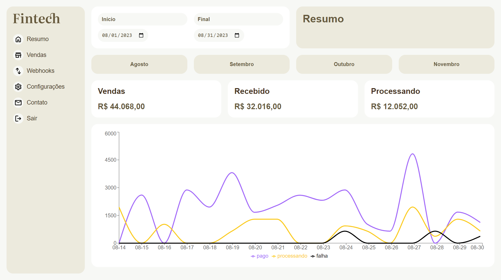

<h2>About the project</h2>

  
<b>Fintech</b> is a panel where there are graphs to be analyzed.

## 👉 Live Demo: <a href='https://fintech-blush.vercel.app/'>Live Demo</a>

### » Skills Used: TypeScript.

##

<h2>Screenshots of the Project 📸</h2>
 
<h3 align='center'>Home Page 🏡</h3>

